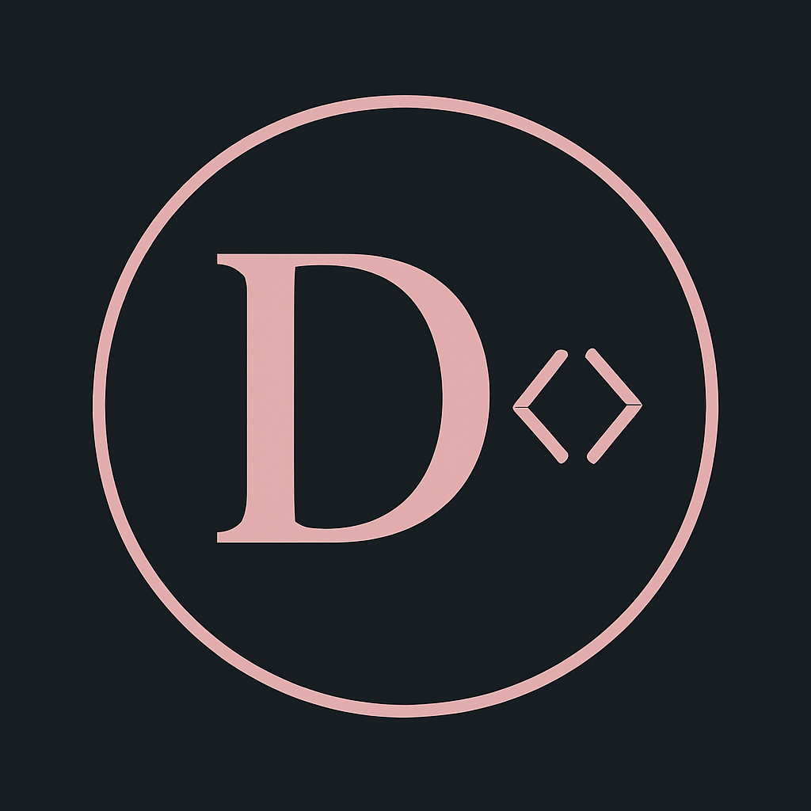

# Daniela Elena Ene — Portfolio

**Personal portfolio · EN/ES · Dark theme · Vanilla JS**

---

A clean, dark-themed personal portfolio showcasing my experience as a web developer — including my **Erasmus+ internship** at the Reykjavík International Film Festival in Iceland 🇮🇸.

**Features**

- Bilingual toggle **EN / ES** — full content switch with vanilla JS
- Smooth scroll reveal animations
- Active nav highlight on scroll
- Fully responsive

**Sections:** About · Experience · Education · Skills · Projects · Languages · Contact

---

Made with 🩷 in Reykjavík

